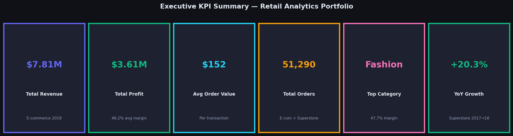
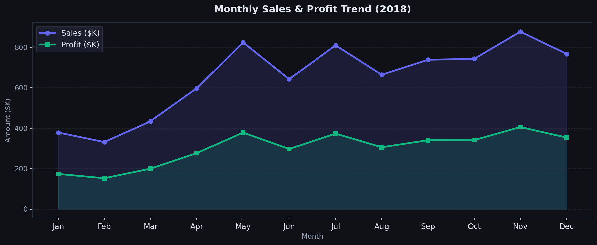
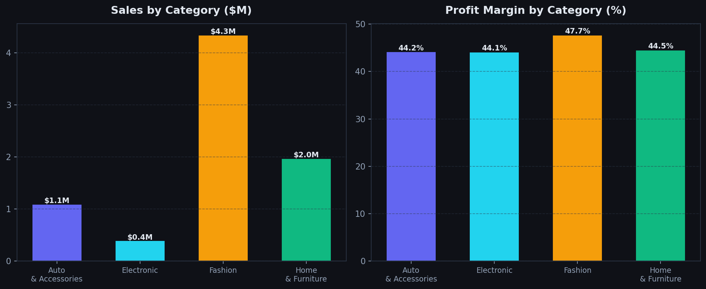
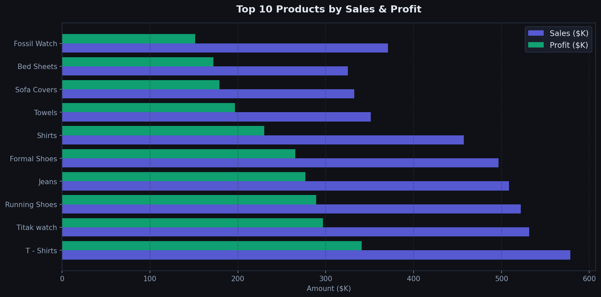
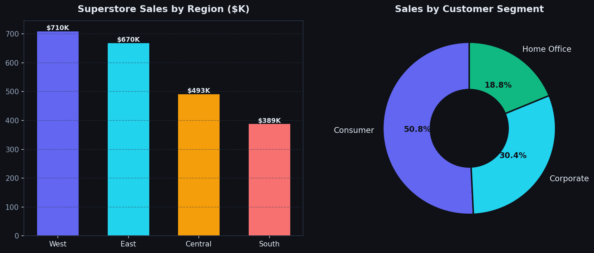
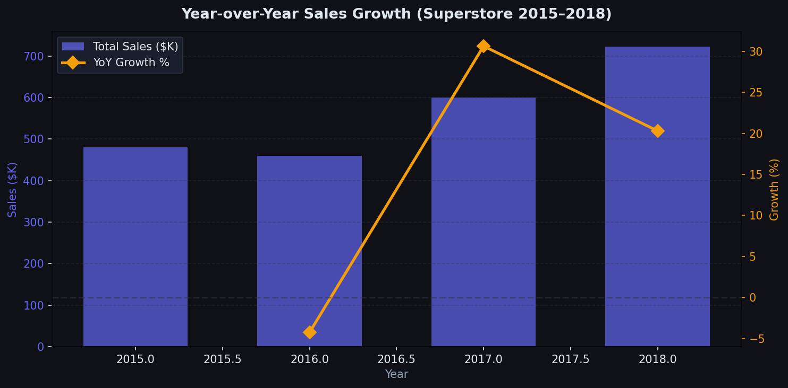
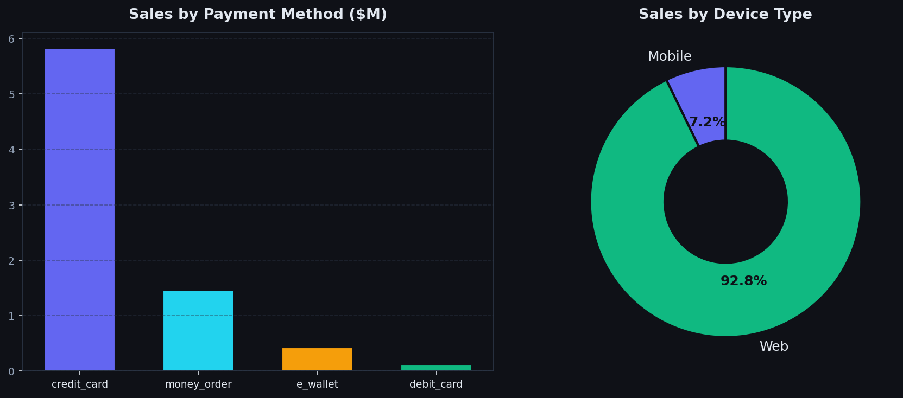

# 📊 Retail & E-Commerce Sales Analytics Portfolio

> **Identifying profitability drivers across products, regions, and customer segments using SQL, Excel, Python, and Power BI.**

---

## 📌 Problem Statement

Retail companies often lack clarity on **which products and regions drive profitability**, making it difficult to allocate marketing budgets, manage inventory, and plan growth strategies. Leaders are forced to make intuition-based decisions instead of data-backed ones.

---

## 🎯 Objective

Analyze sales and profit trends across two real-world retail datasets to:

- Identify top-selling and most profitable products
- Perform month-over-month and year-over-year growth analysis
- Analyze customer segments (Consumer vs Corporate vs Home Office)
- Calculate profit margins by category, product, and region
- Surface underperforming areas and recommend actionable improvements

---

## 📂 Datasets

| Dataset | Source | Rows | Period | Key Fields |
|---|---|---|---|---|
| **E-commerce Dataset** | Kaggle | 51,290 | 2018 | Sales, Profit, Discount, Category, Payment, Device |
| **Superstore Sales** | Tableau / Kaggle | 9,800 | 2015–2018 | Sales, Region, Segment, Category, Sub-Category |

---

## 🛠️ Tools & Approach

### Excel
- Pivot tables for quick category and monthly summaries
- Conditional formatting to flag underperforming products
- Calculated columns for profit margin and discount bands

### SQL
- Sales aggregation by category, region, and time period
- Window functions for MoM and YoY growth (`LAG`, `OVER`)
- Customer segmentation using `CASE WHEN` cohort logic
- Discount impact analysis with banded profit margins

### Python (pandas + matplotlib)
- Full EDA and data cleaning pipeline
- Statistical summaries and trend identification
- All 7 charts generated programmatically (dark-theme, publication-ready)

### Power BI
- Interactive dashboard with KPI cards, slicers, drill-throughs
- DAX measures for running totals, rankings, and conditional flags
- 5-page report covering executive summary through channel analysis

---

## 📊 Key Visualizations

### Executive KPI Summary


### Monthly Sales & Profit Trend (2018)


> **Insight:** May peaks at $824K (+37.8% MoM). November is the second peak at $877K driven by holiday demand. February is the weakest month — a clear window for promotional campaigns.

### Category Sales & Profit Margin


> **Insight:** Fashion dominates with $4.35M in revenue (55.6% share) and the highest profit margin at 47.7%. Electronics has the lowest volume but comparable margins — a scaling opportunity.

### Top 10 Products by Sales & Profit


> **Insight:** Just 10 products account for ~40% of total profit. T-Shirts lead with $340K profit at a 58.9% margin. Fashion apparel and accessories consistently outperform other categories.

### Regional Performance & Customer Segments (Superstore)


> **Insight:** The **South region underperforms** West by $321K (45% gap). Consumer segment drives 50.6% of Superstore revenue, while Home Office (18.7%) is underpenetrated given remote work trends.

### Year-over-Year Growth (Superstore 2015–2018)


> **Insight:** After a -4.3% dip in 2016, the business recovered strongly with +30.6% in 2017 and +20.3% in 2018 — representing ~50% cumulative growth from the dip year.

### Payment Methods & Device Type


> **Insight:** Credit card drives 74.5% of revenue. Mobile accounts for only **7.2% of e-commerce revenue** — far below the ~60% industry average, making mobile UX a critical investment priority.

---

## 💡 Key Findings

### 1. Product Concentration (Pareto Effect)
A small set of products drives the majority of profit. The **top 10 products contribute ~40% of total profit** while representing a fraction of SKU count. Focused inventory and marketing on these items maximises ROI.

### 2. Fashion is the Profit Engine
Fashion is not just the largest category by volume — it also carries the **highest profit margin at 47.7%**, beating Electronics (44.1%), Home & Furniture (44.5%), and Auto & Accessories (44.2%). Prioritising Fashion SKUs in campaigns delivers outsized profit growth.

### 3. Seasonal Revenue Patterns
Two clear peaks emerge: **May** (spring campaign season) and **November** (holiday season). **February is the weakest month**, presenting a low-competition window for targeted promotions. Aligning stock and marketing spend to these cycles can smooth revenue volatility.

### 4. South Region is Underperforming
The South region generates $389K in Superstore sales vs $710K for the West — a **45% gap**. Analysis shows lower order frequency, not lower average order value, suggesting a reach/awareness problem rather than a pricing one. Regional marketing investment is the recommended remedy.

### 5. Strong Multi-Year Growth Trajectory
Superstore delivered **+20.3% YoY growth in 2018** and +30.6% in 2017, following a strategic recovery from a -4.3% dip in 2016. The business has compounded ~50% growth in two years. Sustaining this trajectory requires continued investment in high-margin categories and new customer acquisition.

### 6. Mobile Revenue is a Critical Risk
Mobile generates only **7.2% of e-commerce revenue**, compared to an industry average of ~60% for mobile commerce. This is the single largest unrealised growth opportunity in the dataset. A mobile-first UX redesign and/or dedicated app could meaningfully shift this split.

### 7. Payment Diversification Opportunity
Credit card transactions dominate at 74.5%. E-wallets represent only 5.4%. Given the global growth of digital wallets (Apple Pay, Google Pay, PayPal), expanding payment options is a low-cost acquisition lever that reduces checkout friction.

---

## 📈 Business Impact & Recommendations

| Priority | Action | Expected Impact |
|---|---|---|
| 🔴 High | Invest in Mobile UX / App | Recover 50%+ of untapped mobile revenue |
| 🔴 High | Scale Fashion category marketing | Highest margin + highest volume = outsized ROI |
| 🟡 Medium | South region targeted campaigns | Close 45% revenue gap vs West |
| 🟡 Medium | February promotional calendar | Reduce seasonal revenue dip |
| 🟢 Low | Expand e-wallet payment options | Reduce checkout friction, grow 5.4% → 15%+ |
| 🟢 Low | Electronics category growth plan | High margin, low volume — scaling opportunity |

---

## 📁 Project Structure

```
retail-analytics/
├── README.md                        # This file
├── powerbi_dax_measures.md          # All DAX formulas for Power BI
├── sql/
│   ├── 01_sales_by_category.sql     # Category aggregation + margins
│   ├── 02_regional_analysis.sql     # Region performance + sub-category
│   ├── 03_growth_analysis.sql       # MoM + YoY growth (window functions)
│   ├── 04_customer_segmentation_profit.sql  # Cohort analysis + discount impact
│   └── 05_top_products_payment.sql  # Top SKUs + payment channel analysis
├── notebooks/
│   └── analysis.py                  # Full Python analysis pipeline
└── images/
    ├── 00_kpi_summary.png
    ├── 01_monthly_trend.png
    ├── 02_category_analysis.png
    ├── 03_top_products.png
    ├── 04_region_segment.png
    ├── 05_yoy_growth.png
    └── 06_payment_device.png
```

---

## 🚀 How to Run

```bash
# 1. Clone the repo
git clone https://github.com/YOUR_USERNAME/retail-analytics.git
cd retail-analytics

# 2. Place datasets in data/ folder
#    - E-commerce_Dataset.csv
#    - train.csv

# 3. Install dependencies
pip install pandas matplotlib numpy

# 4. Run full analysis
python notebooks/analysis.py
```

For SQL: Import the CSVs into any SQL engine (MySQL, PostgreSQL, SQLite) and run scripts in `/sql/` sequentially.

For Power BI: Open Power BI Desktop → Get Data → CSV → load both files → paste DAX measures from `powerbi_dax_measures.md`.

---

## 📬 Contact

Built as a data analytics portfolio project demonstrating end-to-end retail analysis across SQL, Python, Excel, and Power BI.

---

*Datasets sourced from Kaggle. All analysis is for portfolio/educational purposes.*
